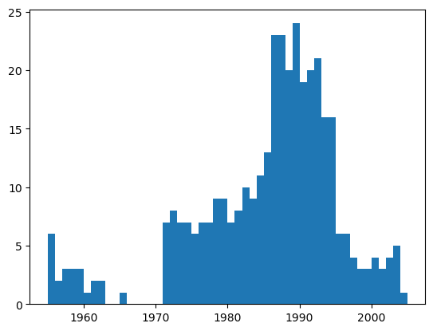
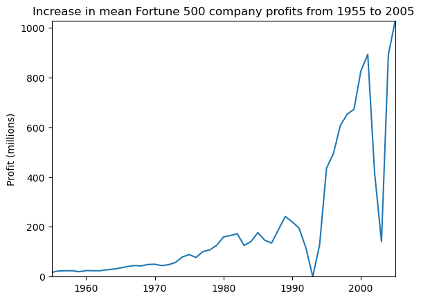
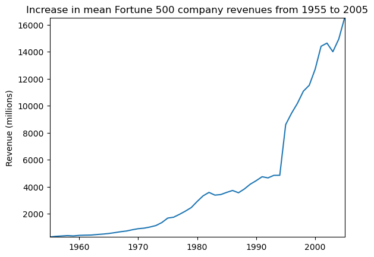
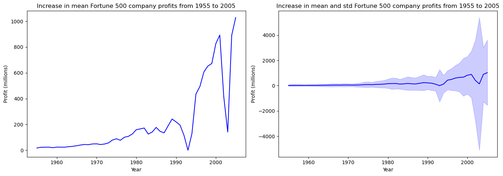

# cell
主要包含两种类型的cell：
代码cell：包含可被kernel执行的代码，执行之后在下方显示输出。
Markdown cell：书写Markdown标记语言的cell。
试着输入一行代码，查看执行效果：


```python
print('Hello World!')
```

代码执行之后，cell左侧的标签从In [ ] 变成了 In [1]。In代表输入，[]中的数字代表kernel执行的顺序，而In [*]则表示代码cell正在执行代码。以下例子显示了短暂的In [*]过程。


```python
import time
time.sleep(3)
```

## cell模式
有两种模式，编辑模式（edit mode）和命名模式（command mode）
编辑模式：enter健切换，绿色轮廓
命令模式：esc健切换，蓝色轮廓

## 快捷键
使用Ctrl + Shift + P命令可以查看所有Notebook支持的命令。

在命名模式下，一些快捷键将十分有帮助

上下键头可以上下cell移动
A 或者 B在上方或者下方插入一个cell
M 将转换活动cell为Markdown cell
Y 将设置活动cell为代码 cell
D+D（两次）删除cell
Z 撤销删除
H 打开所有快捷键的说明
在编辑模式，Ctrl + Shift + -将以光标处作为分割点，将cell一分为二。

# Kernel
每个notebook都基于一个内核运行，当执行cell代码时，代码将在内核当中运行，运行的结果会显示在页面上。Kernel中运行的状态在整个文档中是延续的，可以跨越所有的cell。这意思着在一个Notebook某个cell定义的函数或者变量等，在其他cell也可以使用。例如：


```python
import numpy as np
def square(x):
    return x * x
```

    D:\Anaconda3\lib\site-packages\numpy\_distributor_init.py:30: UserWarning: loaded more than 1 DLL from .libs:
    D:\Anaconda3\lib\site-packages\numpy\.libs\libopenblas.WCDJNK7YVMPZQ2ME2ZZHJJRJ3JIKNDB7.gfortran-win_amd64.dll
    D:\Anaconda3\lib\site-packages\numpy\.libs\libopenblas.XWYDX2IKJW2NMTWSFYNGFUWKQU3LYTCZ.gfortran-win_amd64.dll
      warnings.warn("loaded more than 1 DLL from .libs:"
    

执行上述代码cell之后，后续cell可以使用np和square


```python
x = np.random.randint(1, 10)
y = square(x)
print('%d squared is %d' % (x, y))
```

    4 squared is 16
    

注意：Restart Kernal将清空保存在内存中的变量。同时，在浏览器中关闭一个正在运行的notebook页面，并未真正关闭终止Kernel的运行，其还是后台执行。要真正关闭，可选择File > Close and Halt，或者Kernel > Shutdown。

以下教程将分两个例子实现基本的Notebook编写，包括简单的Python程序和Python数据分析的例子。首先，重命名文档，更改Untitled并输入相关文件名。注意，在写作过程中，常用Ctrl + S保存已有的文档。

# 简单的Python程序的例子
本节主要目的掌握python的基本语法，要求完成基于python的选择排序算法：
    1. 定义selection_sort函数执行选择排序功能。
    2. 定义test函数进行测试，执行数据输入，并调用selection_sort函数进行排序，最后输出结果。


```python
# 定义选择排序函数
def selection_sort(arr):
    n = len(arr)
    for i in range(n):
        # 假设当前 i 是最小的
        min_index = i
        for j in range(i+1, n):
            if arr[j] < arr[min_index]:
                min_index = j
        # 交换当前元素和找到的最小元素
        arr[i], arr[min_index] = arr[min_index], arr[i]

# 测试函数
def test():
    # 用户输入数据
    raw_input = input("请输入一组整数，用空格分隔：")
    arr = list(map(int, raw_input.split()))

    print("排序前：", arr)
    selection_sort(arr)
    print("排序后：", arr)

# 程序入口
if __name__ == "__main__":
    test()
```

    请输入一组整数，用空格分隔：5 2 4 1 3
    排序前： [5, 2, 4, 1, 3]
    排序后： [1, 2, 3, 4, 5]
    

# 数据分析的例子
本例中将分析历年财富世界500强的数据(1955-2005)

# 设置
导入相关的工具库


```python
%matplotlib inline
import pandas as pd
import matplotlib.pyplot as plt
import seaborn as sns
```


```python
df = pd.read_csv('E:/Semester06/fortune500.csv')
```

# 检查数据集
上述代码执行生成的df对象，是pandas常用的数据结构，称为DataFrame，可以理解为数据表。


```python
df.head()
```


<div>
<style scoped>
    .dataframe tbody tr th:only-of-type {
        vertical-align: middle;
    }

    .dataframe tbody tr th {
        vertical-align: top;
    }

    .dataframe thead th {
        text-align: right;
    }
</style>
<table border="1" class="dataframe">
  <thead>
    <tr style="text-align: right;">
      <th></th>
      <th>Year</th>
      <th>Rank</th>
      <th>Company</th>
      <th>Revenue (in millions)</th>
      <th>Profit (in millions)</th>
    </tr>
  </thead>
  <tbody>
    <tr>
      <th>0</th>
      <td>1955</td>
      <td>1</td>
      <td>General Motors</td>
      <td>9823.5</td>
      <td>806</td>
    </tr>
    <tr>
      <th>1</th>
      <td>1955</td>
      <td>2</td>
      <td>Exxon Mobil</td>
      <td>5661.4</td>
      <td>584.8</td>
    </tr>
    <tr>
      <th>2</th>
      <td>1955</td>
      <td>3</td>
      <td>U.S. Steel</td>
      <td>3250.4</td>
      <td>195.4</td>
    </tr>
    <tr>
      <th>3</th>
      <td>1955</td>
      <td>4</td>
      <td>General Electric</td>
      <td>2959.1</td>
      <td>212.6</td>
    </tr>
    <tr>
      <th>4</th>
      <td>1955</td>
      <td>5</td>
      <td>Esmark</td>
      <td>2510.8</td>
      <td>19.1</td>
    </tr>
  </tbody>
</table>
</div>


```python
df.tail()
```


<div>
<style scoped>
    .dataframe tbody tr th:only-of-type {
        vertical-align: middle;
    }

    .dataframe tbody tr th {
        vertical-align: top;
    }

    .dataframe thead th {
        text-align: right;
    }
</style>
<table border="1" class="dataframe">
  <thead>
    <tr style="text-align: right;">
      <th></th>
      <th>Year</th>
      <th>Rank</th>
      <th>Company</th>
      <th>Revenue (in millions)</th>
      <th>Profit (in millions)</th>
    </tr>
  </thead>
  <tbody>
    <tr>
      <th>25495</th>
      <td>2005</td>
      <td>496</td>
      <td>Wm. Wrigley Jr.</td>
      <td>3648.6</td>
      <td>493</td>
    </tr>
    <tr>
      <th>25496</th>
      <td>2005</td>
      <td>497</td>
      <td>Peabody Energy</td>
      <td>3631.6</td>
      <td>175.4</td>
    </tr>
    <tr>
      <th>25497</th>
      <td>2005</td>
      <td>498</td>
      <td>Wendy's International</td>
      <td>3630.4</td>
      <td>57.8</td>
    </tr>
    <tr>
      <th>25498</th>
      <td>2005</td>
      <td>499</td>
      <td>Kindred Healthcare</td>
      <td>3616.6</td>
      <td>70.6</td>
    </tr>
    <tr>
      <th>25499</th>
      <td>2005</td>
      <td>500</td>
      <td>Cincinnati Financial</td>
      <td>3614.0</td>
      <td>584</td>
    </tr>
  </tbody>
</table>
</div>


对数据属性列进行重命名，以便在后续访问


```python
df.columns = ['year', 'rank', 'company', 'revenue', 'profit']
```

接下来，检查数据条目是否加载完整。


```python
len(df)
```


    25500


从1955至2055年总共有25500条目录。然后，检查属性列的类型。


```python
df.dtypes
```


    year         int64
    rank         int64
    company     object
    revenue    float64
    profit      object
    dtype: object


其他属性列都正常，但是对于profit属性，期望的结果是float类型，因此其可能包含非数字的值，利用正则表达式进行检查。


```python
non_numberic_profits = df.profit.str.contains('[^0-9.-]')
df.loc[non_numberic_profits].head()
```


<div>
<style scoped>
    .dataframe tbody tr th:only-of-type {
        vertical-align: middle;
    }

    .dataframe tbody tr th {
        vertical-align: top;
    }

    .dataframe thead th {
        text-align: right;
    }
</style>
<table border="1" class="dataframe">
  <thead>
    <tr style="text-align: right;">
      <th></th>
      <th>year</th>
      <th>rank</th>
      <th>company</th>
      <th>revenue</th>
      <th>profit</th>
    </tr>
  </thead>
  <tbody>
    <tr>
      <th>228</th>
      <td>1955</td>
      <td>229</td>
      <td>Norton</td>
      <td>135.0</td>
      <td>N.A.</td>
    </tr>
    <tr>
      <th>290</th>
      <td>1955</td>
      <td>291</td>
      <td>Schlitz Brewing</td>
      <td>100.0</td>
      <td>N.A.</td>
    </tr>
    <tr>
      <th>294</th>
      <td>1955</td>
      <td>295</td>
      <td>Pacific Vegetable Oil</td>
      <td>97.9</td>
      <td>N.A.</td>
    </tr>
    <tr>
      <th>296</th>
      <td>1955</td>
      <td>297</td>
      <td>Liebmann Breweries</td>
      <td>96.0</td>
      <td>N.A.</td>
    </tr>
    <tr>
      <th>352</th>
      <td>1955</td>
      <td>353</td>
      <td>Minneapolis-Moline</td>
      <td>77.4</td>
      <td>N.A.</td>
    </tr>
  </tbody>
</table>
</div>


确实存在这样的记录，profit这一列为字符串，统计一下到底存在多少条这样的记录。


```python
len(df.profit[non_numberic_profits])
```


    369


总体来说，利润（profit）列包含非数字的记录相对来说较少。更进一步，使用直方图显示一下按照年份的分布情况。


```python
bin_sizes, _, _ = plt.hist(df.year[non_numberic_profits], bins=range(1955, 2006))
```


    

    


可见，单独年份这样的记录数都少于25条，即少于4%的比例。这在可以接受的范围内，因此删除这些记录。


```python
df = df.loc[~non_numberic_profits]
df.profit = df.profit.apply(pd.to_numeric)
```

再次检查数据记录的条目数。


```python
len(df)
```


    25131


```python
df.dtypes
```


    year         int64
    rank         int64
    company     object
    revenue    float64
    profit     float64
    dtype: object


可见，上述操作已经达到清洗无效数据记录的效果。

# 使用matplotlib进行绘图
接下来，以年分组绘制平均利润和收入。首先定义变量和方法。


```python
group_by_year = df.loc[:, ['year', 'revenue', 'profit']].groupby('year')
avgs = group_by_year.mean()
x = avgs.index
y1 = avgs.profit
def plot(x, y, ax, title, y_label):
    ax.set_title(title)
    ax.set_ylabel(y_label)
    ax.plot(x, y)
    ax.margins(x=0, y=0)
```


```python
fig, ax = plt.subplots()
plot(x, y1, ax, 'Increase in mean Fortune 500 company profits from 1955 to 2005', 'Profit (millions)')
```


    

    


看起来像指数增长，但是1990年代初期出现急剧的下滑，对应当时经济衰退和网络泡沫。再来看看收入曲线。


```python
y2 = avgs.revenue
fig, ax = plt.subplots()
plot(x, y2, ax, 'Increase in mean Fortune 500 company revenues from 1955 to 2005', 'Revenue (millions)')
```


    

    


公司收入曲线并没有出现急剧下降，可能是由于财务会计的处理。对数据结果进行标准差处理。


```python
def plot_with_std(x, y, stds, ax, title, y_label):
    ax.fill_between(x, y - stds, y + stds, alpha=0.2)
    plot(x, y, ax, title, y_label)
fig, (ax1, ax2) = plt.subplots(ncols=2)
title = 'Increase in mean and std Fortune 500 company %s from 1955 to 2005'
stds1 = group_by_year.std().profit.values
stds2 = group_by_year.std().revenue.values
plot_with_std(x, y1.values, stds1, ax1, title % 'profits', 'Profit (millions)')
plot_with_std(x, y2.values, stds2, ax2, title % 'revenues', 'Revenue (millions)')
fig.set_size_inches(14, 4)
fig.tight_layout()
```


    

    


可见，不同公司之间的收入和利润差距惊人，那么到底前10%和后10%的公司谁的波动更大了？此外，还有很多有价值的信息值得进一步挖掘。


```python
import matplotlib.pyplot as plt

# 假设你已有 DataFrame 并完成如下分组
# group_by_year = df[['year', 'revenue', 'profit']].groupby('year')
avgs = group_by_year.mean()
stds = group_by_year.std()

x = avgs.index
y = avgs.profit
y_std = stds.profit

# 创建并排子图
fig, (ax1, ax2) = plt.subplots(ncols=2, figsize=(14, 5))

# 左图：利润均值
ax1.plot(x, y, color='blue')
ax1.set_title('Increase in mean Fortune 500 company profits from 1955 to 2005')
ax1.set_ylabel('Profit (millions)')
ax1.set_xlabel('Year')

# 右图：利润均值 + 标准差
ax2.plot(x, y, color='blue')
ax2.fill_between(x, y - y_std, y + y_std, color='blue', alpha=0.2)
ax2.set_title('Increase in mean and std Fortune 500 company profits from 1955 to 2005')
ax2.set_ylabel('Profit (millions)')
ax2.set_xlabel('Year')

# 自动布局
fig.tight_layout()
plt.show()

```


    

    


```python

```


```python

```
